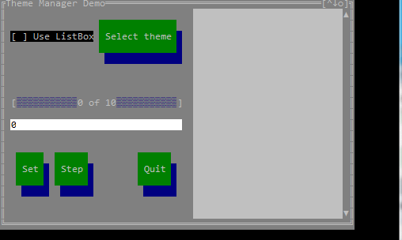
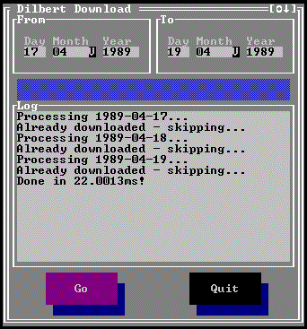

# CLUI 
Command Line User Interface (Console UI inspired by TurboVision) with built-in theme support. Please see screenshots of working examples at the end of the README.

## Installation

    go get -u github.com/VladimirMarkelov/clui

## Current version
The current version is 1.2.1. Please see details in [changelog](./changelog).

## Applications that uses the library
* Terminal FB2 reader(termfb2): https://github.com/VladimirMarkelov/termfb2
* NMCLUI: A tool to connect to wifi networks from console, similar to nmtui. https://github.com/jairochavesb/nmclui.
* Bookmarkscli: A command line bookmark manager. https://github.com/jairochavesb/bookmarkscli.

## Documentation
* [Introduction](/docs/intro.md)
* [Getting started](/docs/hello.md)
* [Layout manager](/docs/layout.md)
* [Basic standrd control methods and properties](/docs/widget.md)
* [About Windows](/docs/window.md)
* [Predefined hotkeys](/docs/hotkeys.md)

## The list of available controls
* Window (Main control container - with maximize, window order and other window features)
* Label (Horizontal and Vertical with basic color control tags)
* Button (Simple push button control)
* EditField (One line text edit control with basic clipboard control)
* ListBox (string list control with vertical scroll)
* TextView (ListBox-alike control with vertical and horizontal scroll, and wordwrap mode)
* ProgressBar (Vertical and horizontal. The latter one supports custom text over control)
* Frame (A decorative control that can be a container for other controls as well)
* Scrollable frame
* CheckBox (Simple check box)
* Radio (Simple radio button. Useless alone - should be used along with RadioGroup)
* RadioGroup (Non-visual control to manage a group of a few RadioButtons)
* ConfirmationDialog (modal View to ask a user confirmation, button titles are custom)
* SelectDialog (modal View to ask a user to select an item from the list - list can be ListBox or RadioGroup)
* SelectEditDialog (modal View to ask a user to enter a value)
* BarChart (Horizontal bar chart without scroll)
* SparkChart (Show tabular data as a bar graph)
* GridView (Table to show structured data - only virtual and readonly mode with scroll support)
* [FilePicker](/docs/fselect.md)
* LoginDialog - a simple authorization dialog with two fields: Username and Password
* TextDisplay - a "virtual" text view control: it does not store any data, every time it needs to draw its line it requests the line from external source by line ID

## Screenshots
The main demo (theme changing and radio group control)

The screencast of demo:

The library is in the very beginning but it can be used to create working utilities: below is the example of my Dilbert comix downloader:

## License

CLUI is dual-licensed under MIT OR BSD-2-Clause
