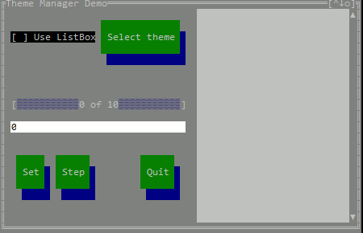
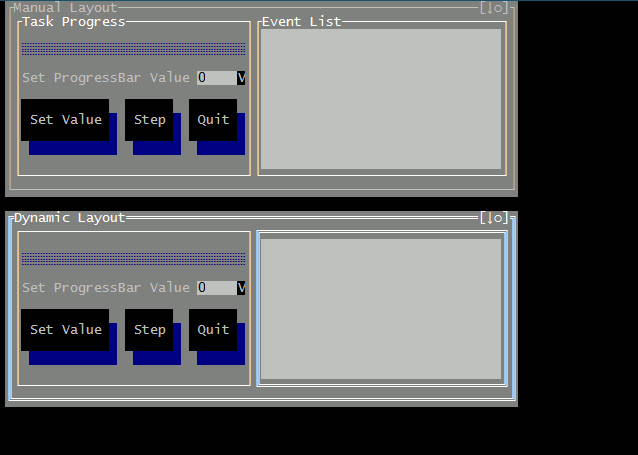
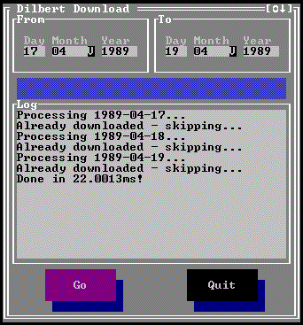

# goTV

Текстовый интерфейс пользователя для командной строки (реализация TurboVision на golang) с поддержкой встроенных тем. Смотрите скриншоты рабочих приложений в конце README.

## Установка

    go get -u github.com/propspero78/goTV

## Текущая сборка

Сборки маркируются по номеру коммита в репозитории

## Приложения использующие эту библиотеку

Ничего не использует. Оригинальное приложение Владимира Маркелова можно посмотреть по ссылке ниже

* Терминальная читалка FB2 (termfb2): https://github.com/VladimirMarkelov/termfb2

## Документация

* [Введение](/docs/intro.md)
* [Привет мир](/docs/hello.md)
* [Менеджер компоновки](/docs/layout.md)
* [Основные стандартные методы и свойства](/docs/widget.md)
* [О ТОкно](/docs/window.md)
* [Предопределённые хоткеи](/docs/hotkeys.md)

## Список доступных контролов

* ТОкно (Main control container - with maximize, window order and other window features)
* Label (Horizontal and Vertical with basic color control tags)
* Button (Simple push button control)
* EditField (One line text edit control with basic clipboard control)
* ListBox (string list control with vertical scroll)
* TextView (ListBox-alike control with vertical and horizontal scroll, and wordwrap mode)
* ProgressBar (Vertical and horizontal. The latter one supports custom text over control)
* Frame (A decorative control that can be a container for other controls as well)
* Scrollable frame
* CheckBox (Simple check box)
* Radio (Simple radio button. Useless alone - should be used along with RadioGroup)
* RadioGroup (Non-visual control to manage a group of a few RadioButtons)
* ConfirmationDialog (modal View to ask a user confirmation, button titles are custom)
* SelectDialog (modal View to ask a user to select an item from the list - list can be ListBox or RadioGroup)
* SelectEditDialog (modal View to ask a user to enter a value)
* BarChart (Horizontal bar chart without scroll)
* SparkChart (Show tabular data as a bar graph)
* GridView (Table to show structured data - only virtual and readonly mode with scroll support)
* [FilePicker](/docs/fselect.md)
* LoginDialog - a simple authorization dialog with two fields: Username and Password
* TextDisplay - a "virtual" text view control: it does not store any data, every time it needs to draw its line it requests the line from external source by line ID

## Скриншоты

Главное демо (изменена тема для группы радокнопок)

Расположение нескольких окон:

The library is in the very beginning but it can be used to create working utilities: below is the example of my Dilbert comix downloader:

